# Manual de usuario
**Sistema:** Tiendita Maday
**Cliente:** La Familia
**Versión:** 2.0
**Fecha de revisión:** 16 de julio de 2026
**Revisión documentada:** `852c5ce` en `main`
**Perfiles cubiertos:** Cliente, cajero, almacén, gerente y administrador

> Guía práctica de operación con capturas reales del sistema. Cubre procesos, consultas de control, seguridad, gestión de usuarios y funciones principales. Los nombres de algunos botones pueden variar en revisiones posteriores; valide siempre el commit desplegado.

<!-- PAGEBREAK -->

## 1. Antes de comenzar

Utilice una versión vigente de Chrome, Edge, Firefox o Safari y una conexión estable. En equipos compartidos, cierre sesión al terminar. No permita que el navegador guarde la contraseña administrativa en una computadora de caja o almacén.

### 1.1 Inicio de sesión

1. Abra la URL oficial proporcionada por el responsable técnico.
2. Escriba su correo en el campo **Correo electrónico** y su contraseña en **Contraseña**.
3. Si el equipo es de su uso exclusivo, puede marcar **Recuérdame** para mantener la sesión.
4. Presione el botón **Iniciar Sesión**. También está disponible **Acceder con Google** para cuentas de cliente vinculadas.
5. El sistema lo enviará automáticamente al área correspondiente a su rol.
6. Si su rol acaba de cambiar, cierre la sesión y vuelva a entrar para renovar sus permisos.

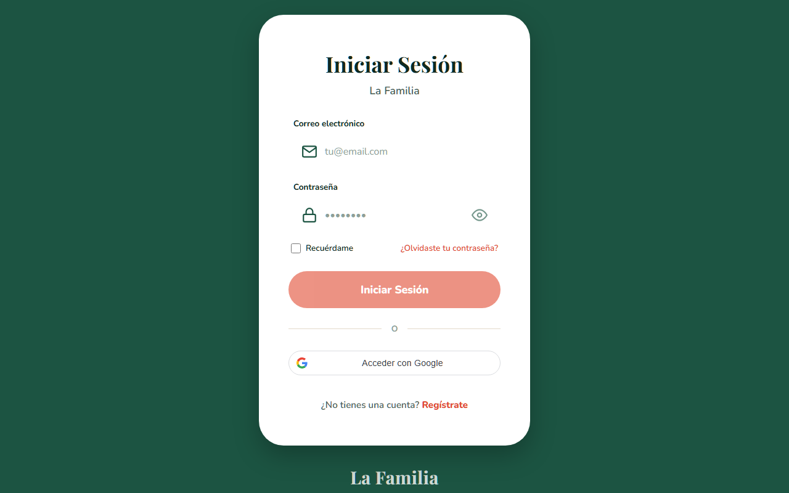

| Rol | Destino principal |
|---|---|
| Cliente | Catálogo y página de inicio. |
| Cajero | Caja y punto de venta. |
| Almacén | Existencias. |
| Administrador o gerente | Panel administrativo. |

### 1.2 Recuperación de acceso

1. En la pantalla de acceso, presione **¿Olvidaste tu contraseña?**.
2. Escriba el correo registrado de su cuenta y presione **Enviar Enlace**.
3. Revise su correo; el enlace de recuperación tiene vigencia limitada.
4. Si no llega, revise la carpeta de spam y confirme con soporte que el servicio de correo está configurado.

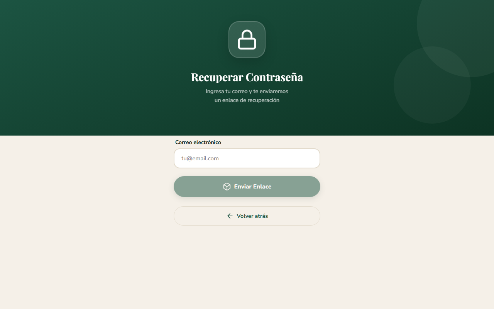

> Nunca envíe contraseñas por mensajería. Si alguien le pide su contraseña por WhatsApp o correo, repórtelo al responsable.

### 1.3 Estados y mensajes

- Un mensaje verde confirma que la operación terminó (por ejemplo, "Producto Agregado").
- Un mensaje de validación indica que falta un dato o que el formato no es válido.
- Un error de permisos significa que la cuenta no tiene el rol requerido.
- Si la aplicación anuncia una actualización durante caja, inventario o checkout, termine o cancele la operación actual antes de recargar.

## 2. Cliente: compra en línea

### 2.1 Consultar y seleccionar productos

1. Inicie sesión como cliente. Llegará a la página de inicio con el buscador, las **Categorías** y los **Productos Populares**.
2. Recorra el catálogo, use el buscador **"Busca un producto..."** o entre por categoría.
3. Toque un producto para abrir su detalle: precio por unidad, disponibilidad en inventario y reseñas.
4. Ajuste la cantidad con los botones **−** y **+** de la esquina superior.
5. Presione **Agregar al carrito**. Un mensaje verde confirmará "Producto Agregado".

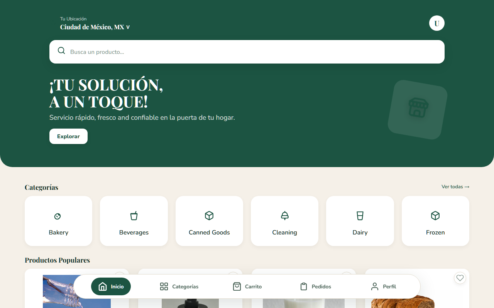

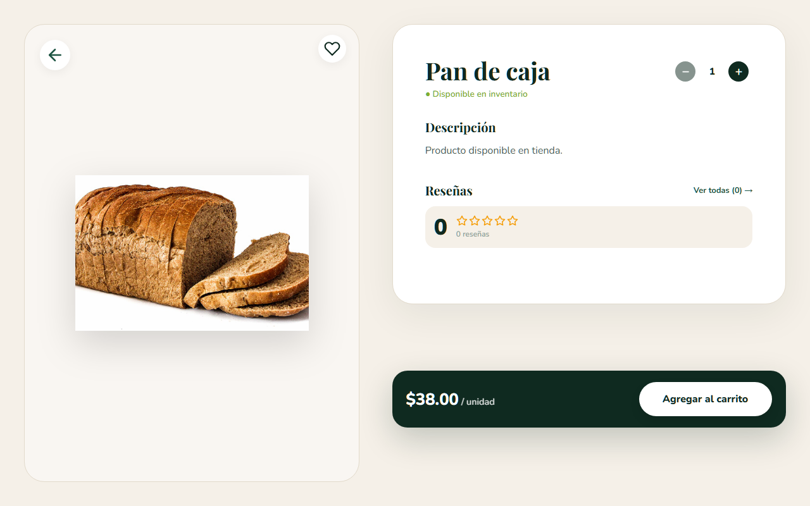

El precio y la existencia finales se validan nuevamente en el servidor al confirmar la compra. Lo mostrado en una pestaña antigua no garantiza disponibilidad.

### 2.2 Revisar el carrito

1. Abra **Carrito** en la barra inferior. El número rojo indica cuántas piezas lleva.
2. Revise producto por producto: cambie cantidades con **−** y **+** o elimine con el bote de basura.
3. Verifique el **Total a pagar** y presione **Proceder al pago**.

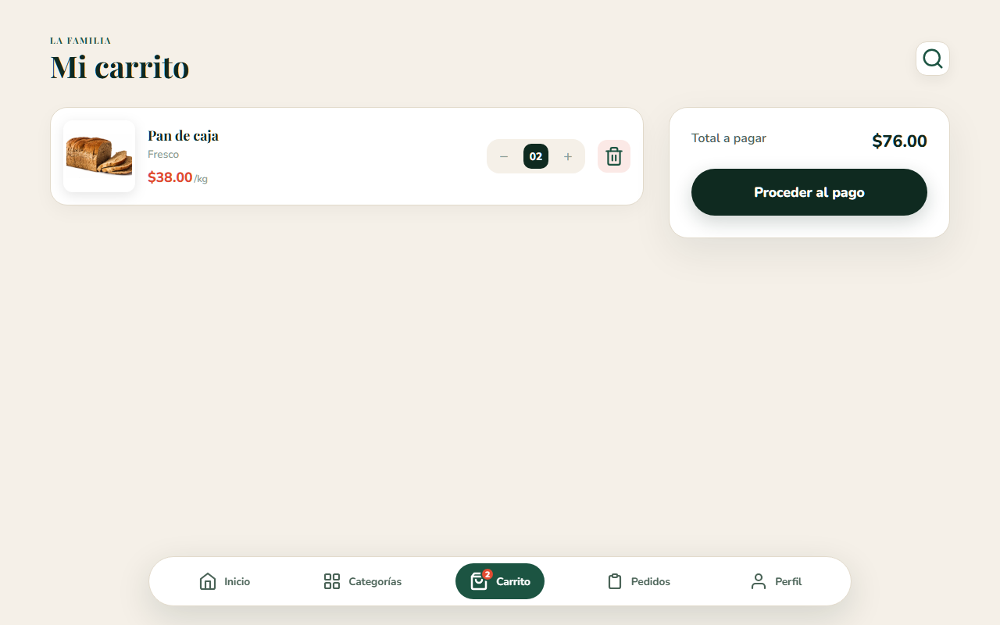

### 2.3 Dirección, entrega y pago

El pago se completa en cuatro pasos numerados en la parte superior de la pantalla **Finalizar compra**:

1. **Identificación:** confirme con qué cuenta desea continuar ("Continuar como").
2. **Dirección:** seleccione o registre una dirección de entrega.
3. **Envío:** elija recolección o entrega cuando esas opciones estén habilitadas. Para entrega, confirme el punto del mapa y la zona; la tarifa se calcula en el servidor según la distancia.
4. **Pago y resumen:** revise productos, descuentos, envío y total; seleccione el método de pago disponible y confirme una sola vez.
5. Espere la pantalla de resultado y guarde el número del pedido.

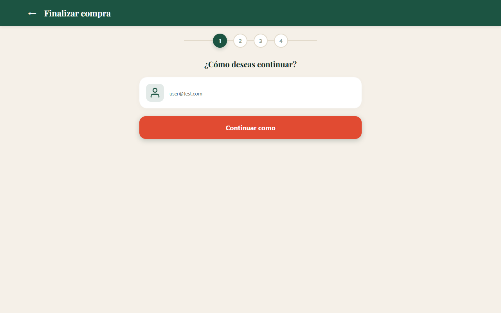

> Si PayPal confirma el cobro pero el sistema no muestra el pedido, no repita el pago. Guarde el identificador de PayPal y comuníquelo a soporte para conciliación.

### 2.4 Pedidos y perfil

En **Pedidos** puede consultar el estado de cada compra (por ejemplo, ENTREGADO) y abrir el detalle. En **Perfil** puede administrar información personal, **Mis Direcciones** y **Métodos de Pago**; ahí también están el **Centro de Ayuda**, los **Términos y Privacidad** y el botón **Cerrar Sesión**.

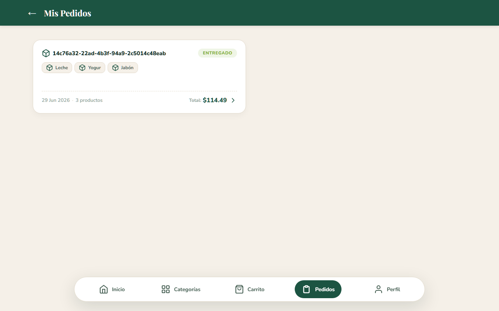

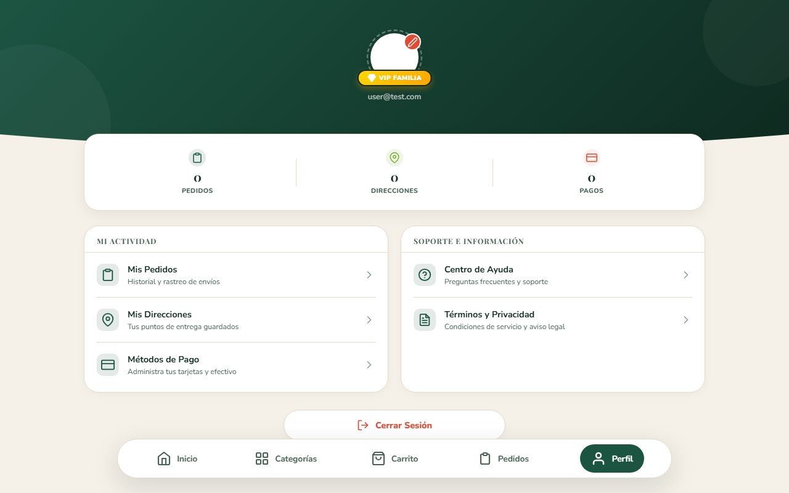

## 3. Cajero: apertura, venta y corte

### 3.1 Abrir caja

1. Inicie sesión con una cuenta `cashier`, `admin` o `manager` autorizada. Entrará a **Maday Caja**, el punto de venta.
2. Si la caja está cerrada, el sistema muestra la ventana **Abrir caja** (inicio de turno).
3. Cuente el efectivo con el que inicia y captúrelo en **Fondo inicial**.
4. Seleccione el **Turno** (matutino o vespertino) y presione **Abrir caja**.
5. No inicie ventas hasta que el indicador superior cambie a **Caja abierta**.

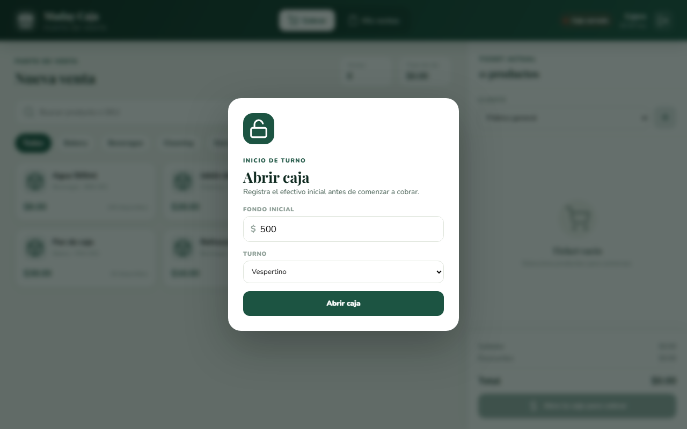

Cada cajero opera su propia caja. Una venta requiere un empleado vinculado a la cuenta y una caja abierta.

### 3.2 Registrar una venta

1. En **Nueva venta**, busque productos con **"Buscar producto o SKU"**, por categoría o escaneando en el campo **Código de barras**.
2. Toque cada producto para agregarlo al **Ticket actual**; tóquelo de nuevo para sumar piezas o use **−** y **+** en el ticket.
3. Verifique cantidades, precios y el **Total**.
4. Si la venta necesita asociarse a un cliente, selecciónelo o créelo en el campo **Cliente** (por defecto "Público general").
5. Presione el botón verde **Cobrar**.
6. En la ventana **Finalizar venta**, elija **Efectivo** o **Tarjeta**.
7. En efectivo, capture el **Efectivo recibido** y compruebe el **Cambio** calculado.
8. En tarjeta, confirme primero la aprobación en la terminal externa.
9. Presione **Confirmar cobro** y entregue o guarde el comprobante.

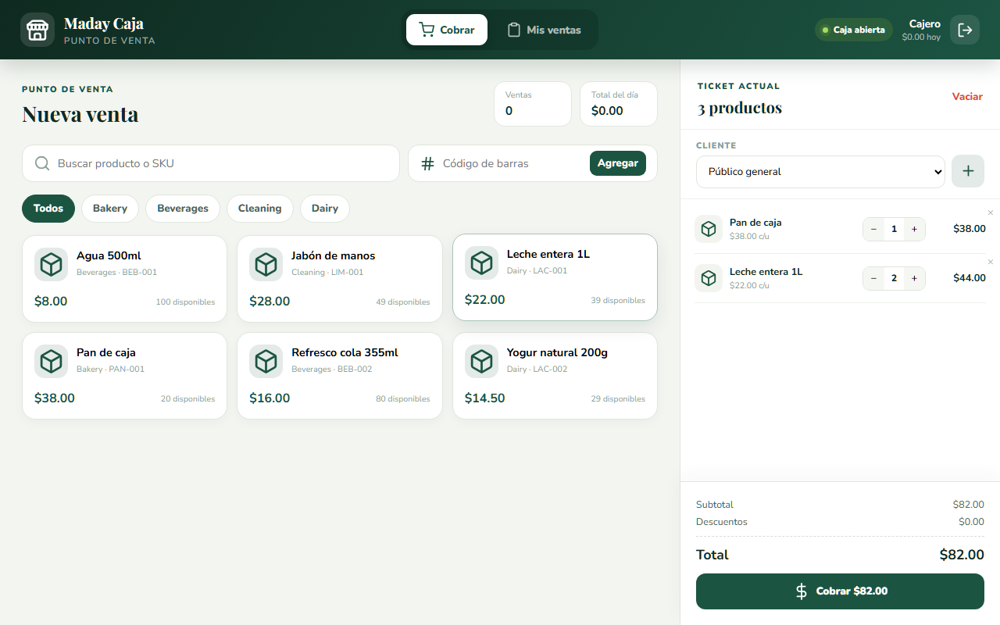

El servidor vuelve a calcular precios, stock y total dentro de una transacción. No entregue mercancía si la interfaz informa que la venta no se completó.

### 3.3 Consultar ventas y cerrar caja

1. Abra **Mis ventas** en la barra superior para revisar las operaciones de su turno: ventas del día, importe vendido, efectivo esperado y estado de caja.
2. Al terminar el turno, cuente el efectivo físico sin modificar ventas anteriores.
3. Presione el botón rojo **Cerrar caja**.
4. En la ventana **Corte de turno**, capture el **Efectivo contado**.
5. Compare contra el **Efectivo esperado** y revise la **Diferencia** calculada.
6. Presione **Confirmar corte** y reporte inmediatamente cualquier diferencia.

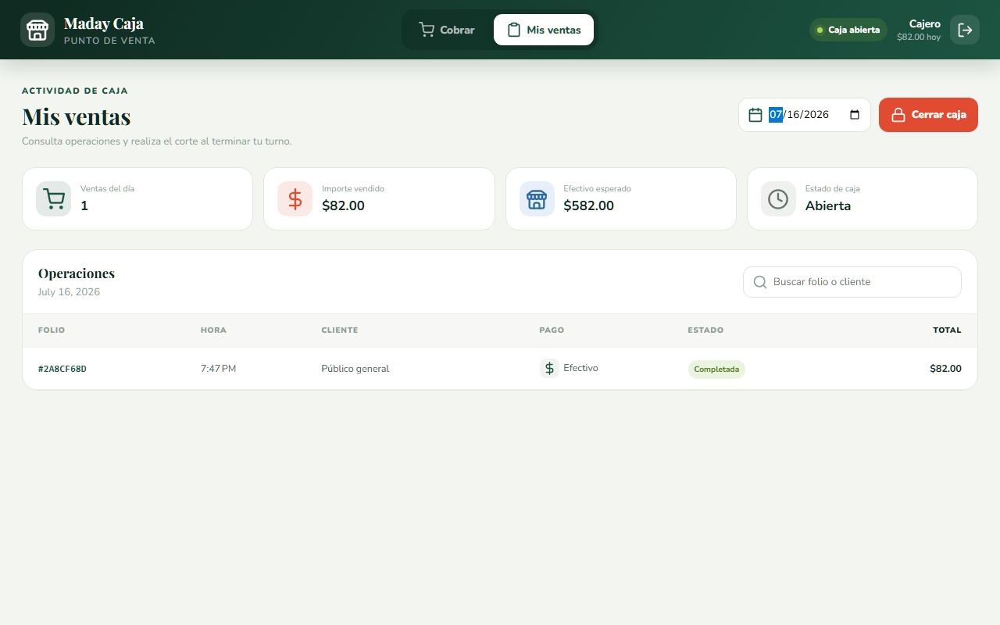

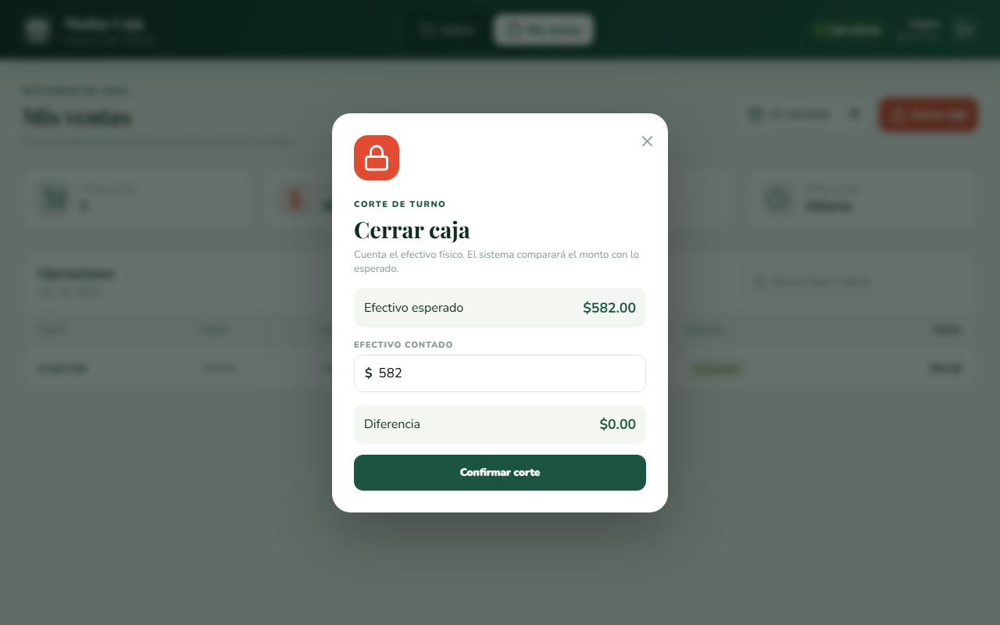

| Situación | Acción correcta |
|---|---|
| Producto no aparece | Solicitar al administrador revisar producto activo, stock y código. |
| Stock insuficiente | Ajustar la cantidad; no completar por fuera del sistema. |
| Terminal rechaza tarjeta | No confirmar la venta como pagada. |
| Venta duplicada | Detenerse y pedir revisión; no borrar registros manualmente. |
| Diferencia de caja | Registrar el monto real y explicar la diferencia al responsable. |

## 4. Almacén: existencias y movimientos

### 4.1 Consultar existencias

1. Inicie sesión con rol `stock` o use **Abrir Inventario** desde el panel administrativo. Entrará a **Maday Inventario**.
2. La pestaña **Existencias** muestra productos activos, unidades disponibles, alertas de stock bajo y el valor a costo del inventario.
3. Filtre por nombre o SKU, categoría o estado, o localice un producto con **Buscar por código de barras**.
4. Atienda las alertas de stock bajo y productos con caducidad.

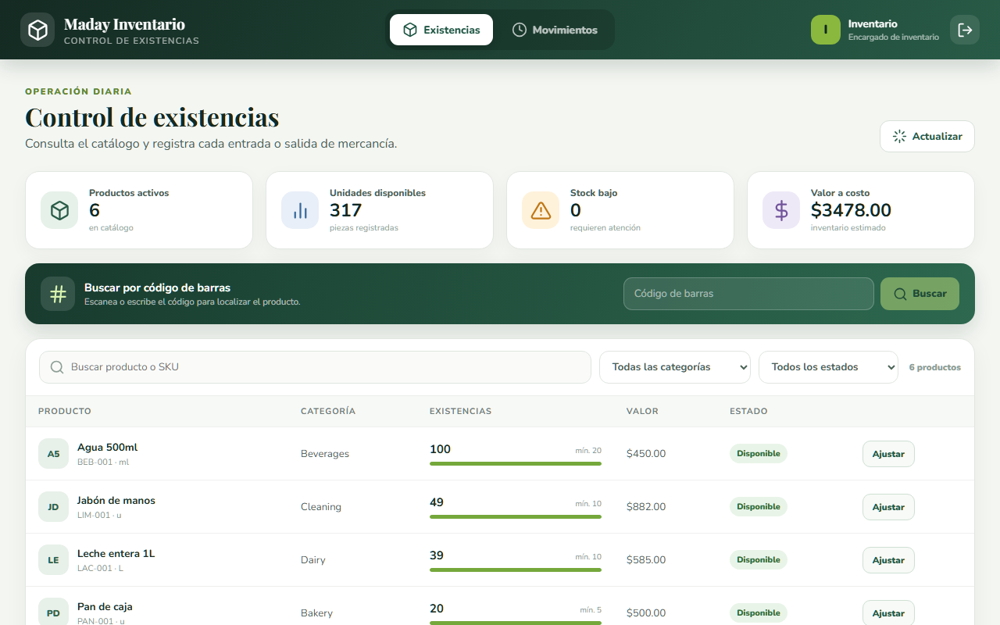

### 4.2 Registrar una entrada o salida manual

1. Localice el producto correcto y presione **Ajustar**.
2. En la ventana **Movimiento de inventario**, elija **Entrada** (agregar mercancía) o **Salida** (retirar mercancía).
3. Capture una **Cantidad** entera positiva.
4. Seleccione el **Motivo** (por ejemplo: recepción de mercancía, devolución, merma o daño, caducidad, corrección de conteo).
5. Escriba una **Nota** que permita auditar el movimiento: proveedor, folio, causa.
6. Revise la vista previa **"Existencia después del movimiento"** y presione **Confirmar movimiento**.
7. Compruebe el resultado en la pestaña **Movimientos**.

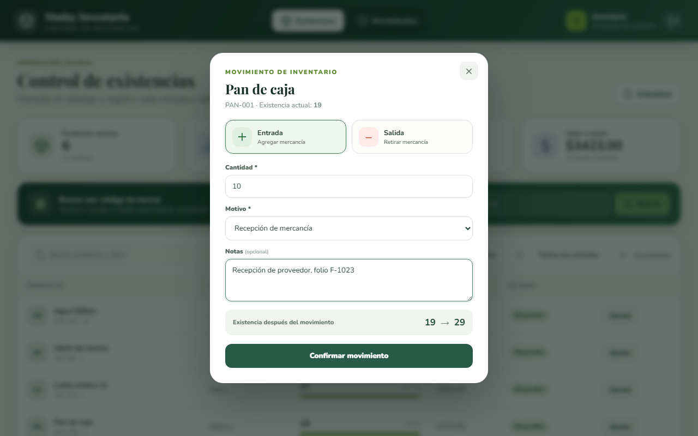

El sistema no permite stock negativo. Cada ajuste guarda responsable, cantidad anterior, cantidad nueva, fecha, motivo y nota.

### 4.3 Buenas prácticas de inventario

- Registre recepciones y ajustes cuando ocurren, no al final de la semana.
- No utilice una entrada para ocultar una devolución o venta mal registrada.
- Escriba notas concretas: proveedor, folio, merma, rotura o conteo físico.
- Compare periódicamente el inventario físico con el sistema.
- No comparta la cuenta de almacén entre turnos.

## 5. Administración y gerencia

Los roles `admin` y `manager` comparten el panel administrativo **Maday Admin**. Algunas funciones de propietario, en particular **Finanzas** y **Configuración**, pueden exigir permiso de propietario adicional.

### 5.1 Panel y módulos

Al entrar verá el **Panel de Control** con ventas totales, pedidos, catálogo, clientes activos, la tendencia de ventas de los últimos siete días, existencias críticas y productos más vendidos. El menú lateral da acceso a todos los módulos y a los accesos directos **Abrir Inventario**, **Abrir Punto de Venta** y **Volver a Tienda**.

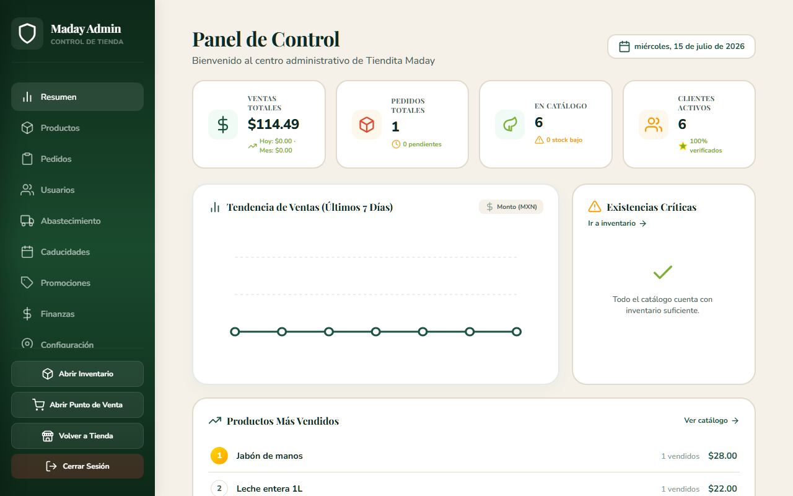

| Módulo | Operación principal |
|---|---|
| Resumen | Métricas y actividad del negocio. |
| Productos | Productos, categorías, precios, existencias e imágenes. |
| Pedidos | Consulta y actualización del ciclo de pedidos. |
| Usuarios | Alta, activación y asignación de roles. |
| Abastecimiento | Proveedores, órdenes de compra y recepción. |
| Caducidades | Lotes próximos a vencer y seguimiento. |
| Promociones | Descuentos programados por producto y vigencia. |
| Finanzas | Gastos, auditorías de caja y diferencias (propietario). |
| Configuración | Datos de tienda, zonas y reglas de envío (propietario). |

### 5.2 Crear usuarios y asignar roles

1. Abra **Usuarios** en el menú lateral. Verá el directorio con la lista de cuentas y su detalle.
2. Presione **+ Nuevo cajero** (o cree la cuenta que corresponda) con nombre, correo y contraseña temporal.
3. En el detalle del usuario, asigne el **Rol de acceso** mínimo necesario en **Privilegios Administrativos**.
4. Entregue la credencial temporal por un canal seguro.
5. Pida a la persona iniciar sesión y cambiar su contraseña.
6. Desactive las cuentas de personal que deja de colaborar.

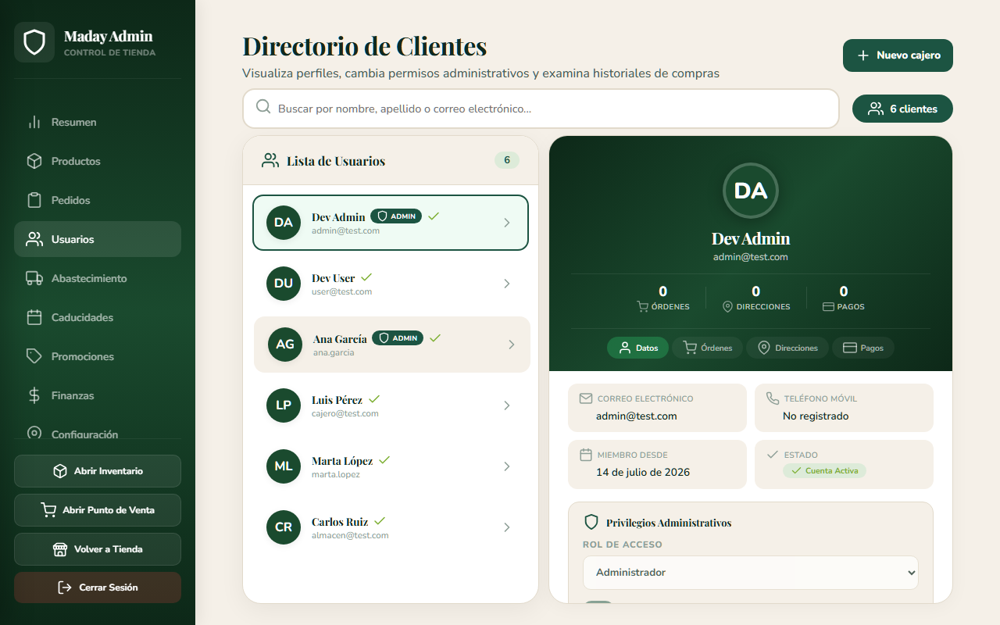

Asignar `manager` concede control administrativo amplio, incluida la gestión de usuarios. El administrador y el gerente no pueden desactivar su propia cuenta ni retirarse a sí mismos los permisos desde el panel.

### 5.3 Productos y abasto

En **Productos** puede crear, editar, activar o desactivar productos y ajustar existencias. Al crear o modificar un producto, confirme nombre, categoría, unidad, SKU, código de barras, precio, costo, stock mínimo, caducidad e imagen. Evite reutilizar códigos de barras.

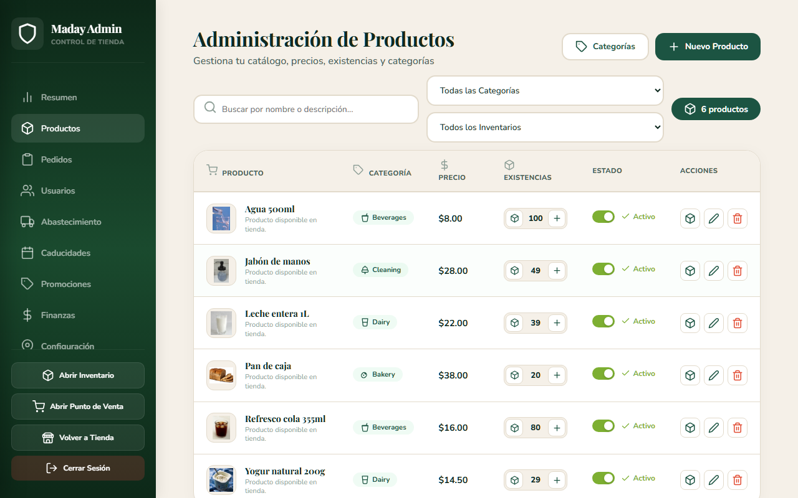

En recepciones de mercancía, use el módulo **Abastecimiento** (pestañas Proveedores, Órdenes y Por recibir) para conservar trazabilidad, en lugar de un ajuste manual genérico.

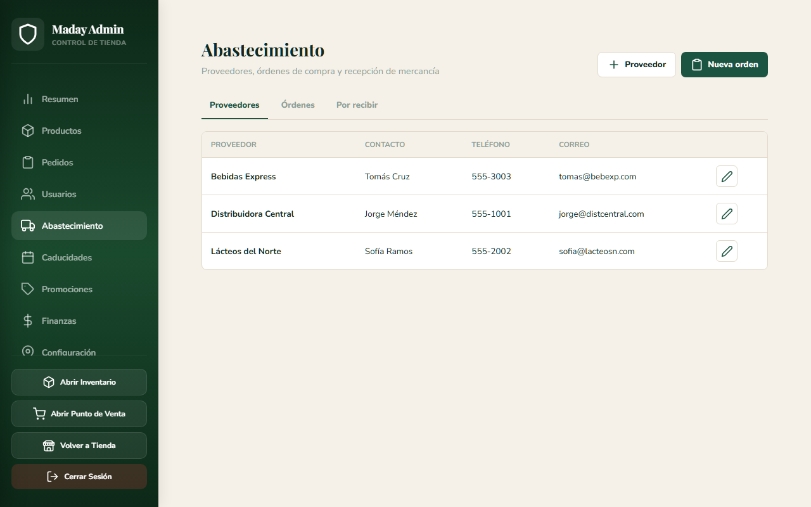

### 5.4 Pedidos, promociones y caducidades

- En **Pedidos** revise el flujo por estado (Pendientes, Preparando, En Camino, Entregados) y cambie el estado solo cuando la operación real lo justifique.
- En **Promociones** defina descuentos con fecha de inicio y fin; pruebe su efecto antes de publicarlos.
- En **Caducidades** atienda los lotes vencidos o por vencer: puede **Editar fecha**, crear una **Promoción** para acelerar la salida o **Retirar** el lote documentando la merma.
- No modifique directamente PostgreSQL para resolver una incidencia operativa ordinaria.

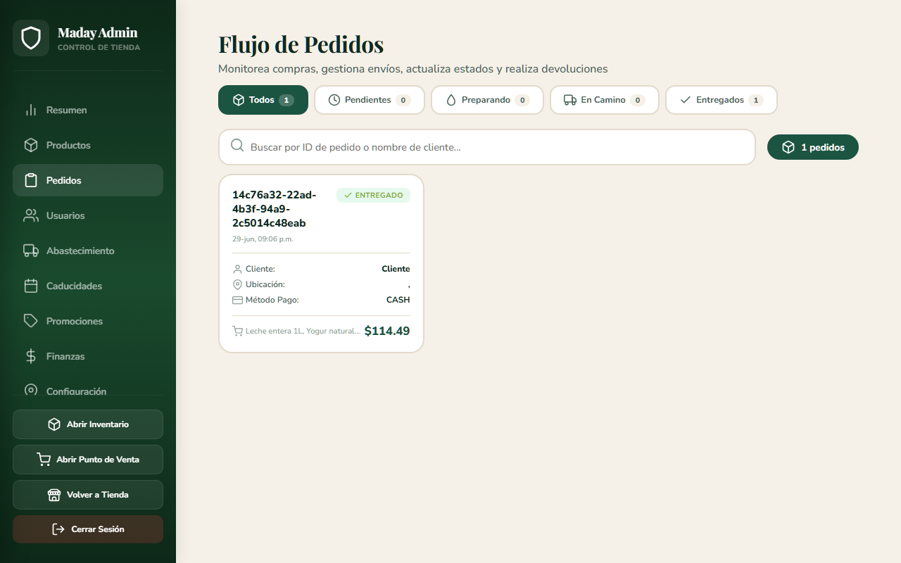

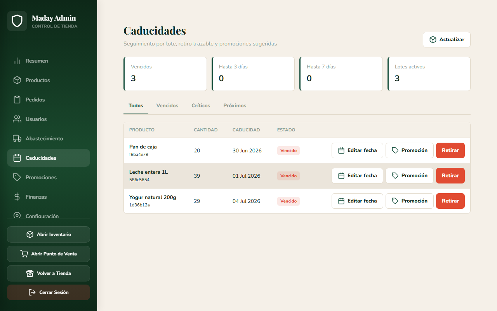

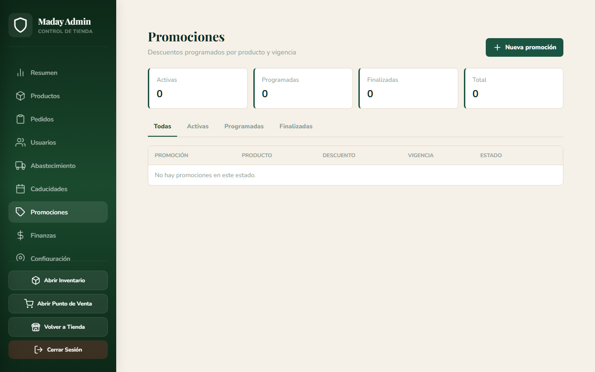

### 5.5 Finanzas y configuración (propietario)

**Finanzas** concentra gastos, auditorías de caja y la diferencia acumulada de cortes. Registre cada gasto con categoría y método; los registros son inmutables y las correcciones se hacen por reverso.

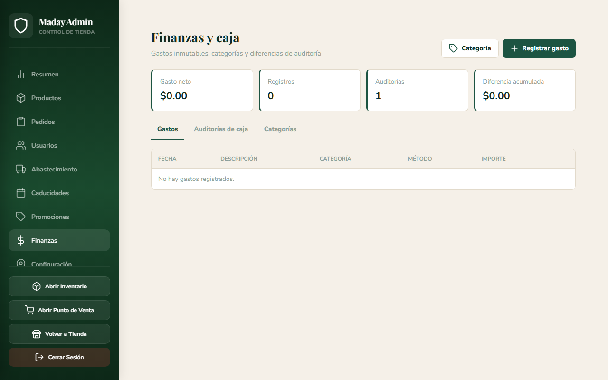

**Configuración** define el nombre de la tienda, la dirección, el monto de envío gratis, el recargo express y las **zonas concéntricas** de entrega sobre el mapa. Las zonas determinan la tarifa de envío que se cobra al cliente; deben continuar donde termina la anterior. Presione **Guardar cambios** al terminar.

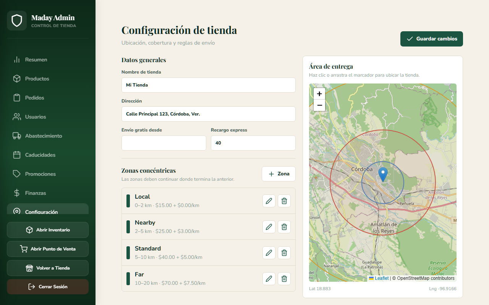

## 6. Seguridad operativa

- Use contraseñas únicas y no las comparta.
- Mantenga solo una o dos cuentas con acceso de propietario.
- Desactive cuentas sin uso.
- Revise diferencias de caja y movimientos de inventario con responsable.
- Evite operar desde redes públicas o dispositivos sin bloqueo.
- Cierre sesión antes de entregar el equipo a otra persona.
- Reporte pagos inconsistentes, accesos desconocidos o cambios no autorizados.

## 7. Solución rápida de problemas

| Problema | Verificación inicial | Escalar cuando |
|---|---|---|
| No inicia sesión | Correo, contraseña, cuenta activa y conexión. | La recuperación no llega o varias cuentas fallan. |
| Pantalla sin datos | Conexión, recargar una vez y volver a iniciar sesión. | El problema ocurre en varios equipos. |
| No permite vender | Caja abierta, empleado vinculado, stock y rol. | Los datos son correctos y la API rechaza la venta. |
| La venta no aparece en Mis ventas | Cambiar la fecha del filtro al día siguiente (ver reporte de limitaciones). | La venta tampoco aparece con otra fecha. |
| Tarifa de envío inesperada | Punto del mapa, zona y configuración. | La dirección está bien y el cálculo se repite. |
| Imagen no carga | Formato, tamaño y conexión. | Falla en todos los productos nuevos. |
| Diferencia de inventario | Historial de movimientos y ventas recientes. | No existe movimiento que explique la diferencia. |

## 8. Listas de cierre diario

### Cajero

- [ ] Todas las ventas del turno aparecen en Mis ventas.
- [ ] La terminal externa coincide con las ventas con tarjeta.
- [ ] El efectivo fue contado y el corte fue confirmado.
- [ ] Las diferencias tienen una explicación entregada al responsable.
- [ ] La sesión se cerró.

### Gerente o propietario

- [ ] No hay pedidos detenidos sin responsable.
- [ ] Se revisaron alertas de bajo stock y caducidad.
- [ ] Se revisaron diferencias de caja.
- [ ] No existen cuentas activas de personal dado de baja.
- [ ] El respaldo más reciente está dentro del objetivo acordado.

<!-- PAGEBREAK -->

## 9. Reportes y consultas de control

Tiendita Maday ofrece vistas operativas para tomar decisiones y conservar trazabilidad. No todas generan un archivo descargable; cuando se requiera un informe firmado, registre periodo, filtros, responsable y commit, y utilice la impresión del navegador o una exportación autorizada sin alterar los datos.

| Consulta o reporte | Responsable habitual | Qué revisar | Evidencia recomendada |
|---|---|---|---|
| Panel de Control | Gerente/administrador | Ventas, pedidos, clientes, tendencia, stock crítico y más vendidos. | Captura fechada y periodo. |
| Mis ventas / corte | Cajero y gerente | Folio, hora, método, total, efectivo esperado/contado y diferencia. | Folios, corte y explicación. |
| Movimientos de inventario | Almacén/gerente | Producto, entrada/salida, cantidades, motivo, nota, responsable y fecha. | Filtro aplicado y movimiento. |
| Pedidos por estado | Administración | Pendientes, preparación, ruta y entrega. | Pedido y cambio de estado. |
| Finanzas y auditoría de caja | Propietario | Gastos, cortes y diferencias acumuladas. | Periodo, responsable y reversos. |
| Caducidades | Almacén/administración | Lotes vencidos o próximos a vencer y acción tomada. | Lote, fecha y retiro/promoción. |

### 9.1 Cómo obtener evidencia confiable

1. Confirme el ambiente y la cuenta con la que está operando.
2. Seleccione la fecha o filtro necesario; anótelo si no aparece en la captura.
3. Verifique que totales y folios correspondan al periodo solicitado.
4. Oculte correos, direcciones, tokens y cualquier dato personal que no sea indispensable.
5. Guarde el archivo con fecha, tipo y responsable, por ejemplo `2026-07-16_corte_caja_turno-matutino.pdf`.
6. Si una cifra no coincide, no edite la evidencia: abra una incidencia y conserve ambas versiones.

### 9.2 Conciliaciones recomendadas

- compare ventas con tarjeta contra la terminal externa;
- compare efectivo esperado contra efectivo contado y documente diferencias;
- compare salidas por venta y ajustes contra el historial de inventario;
- compare pedidos pagados contra confirmaciones del proveedor;
- revise caducidades y mermas antes del cierre de periodo.

## 10. Gestión segura de usuarios

### 10.1 Alta

1. Confirme que la persona requiere acceso y defina su responsable.
2. Cree una cuenta individual; no reutilice cuentas de otra persona.
3. Asigne el rol mínimo necesario.
4. Entregue la contraseña temporal por un canal separado y seguro.
5. Pida inicio de sesión y cambio de contraseña.
6. Registre fecha de alta, rol y autorización.

### 10.2 Cambio de rol

1. Obtenga autorización del gerente o propietario.
2. Cambie únicamente el rol necesario.
3. Pida al usuario cerrar sesión y volver a entrar.
4. Verifique que puede acceder a su módulo y no a áreas superiores.
5. Registre quién autorizó y quién realizó el cambio.

### 10.3 Baja

1. Desactive la cuenta al terminar la relación laboral o cuando deje de necesitar acceso.
2. No borre movimientos históricos asociados a la persona.
3. Revoque accesos externos a GitHub, Railway, correo o proveedores si aplican.
4. Rote cualquier secreto compartido conocido por esa persona.
5. Confirme que no puede volver a iniciar sesión.

> Administrador, gerente y propietario son accesos de alto impacto. Revise estas cuentas al menos trimestralmente y después de cualquier cambio de personal.

## 11. Matriz de cobertura del manual

| Requisito | Secciones que lo cubren | Evidencia incluida |
|---|---|---|
| Procesos | 2 a 5 y 8 | Compra, caja, inventario, administración y cierres. |
| Reportes | 3.3, 4.2, 5.1, 5.5 y 9 | Ventas, corte, movimientos, panel y finanzas. |
| Seguridad | 1, 5.2, 6 y 10 | Acceso, roles, contraseñas, altas, cambios y bajas. |
| Gestión de usuarios | 5.2 y 10 | Directorio, rol mínimo, alta, cambio y desactivación. |
| Funciones principales | 2 a 5 | Capturas de los cinco perfiles. |
| Manejo de errores | 1.3, tablas de caja y sección 7 | Validaciones, fallos frecuentes y escalamiento. |

## 12. Registro de revisión

| Versión | Fecha | Revisión | Cambio principal |
|---|---|---|---|
| 1.1 | 15-jul-2026 | Revisión previa | Recorrido visual de cinco roles. |
| 2.0 | 16-jul-2026 | `852c5ce` | Reportes, conciliación, ciclo de usuarios y matriz de cobertura. |

**Limitación:** este manual documenta el comportamiento observado y esperado de la revisión indicada. No sustituye el reporte de pruebas, la guía de operación ni una capacitación con datos y servicios del ambiente definitivo.
