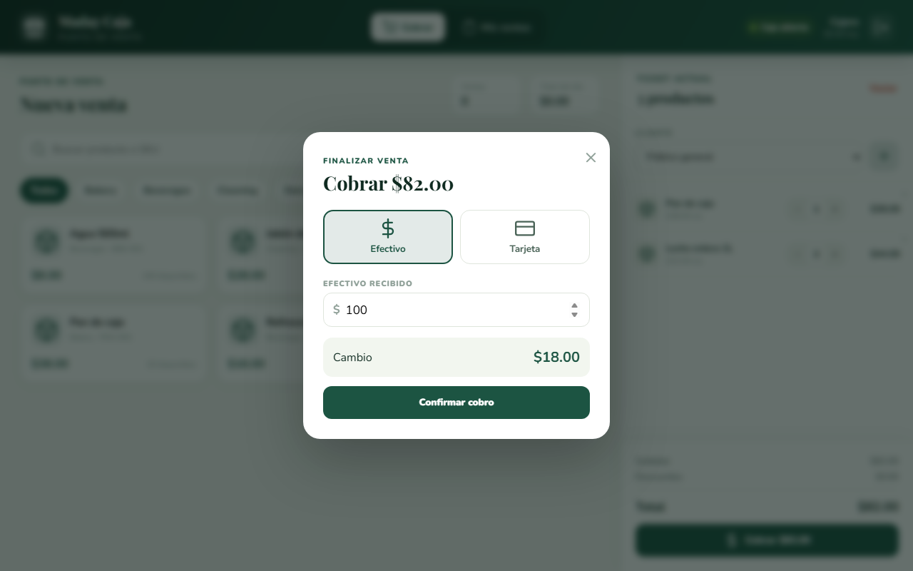
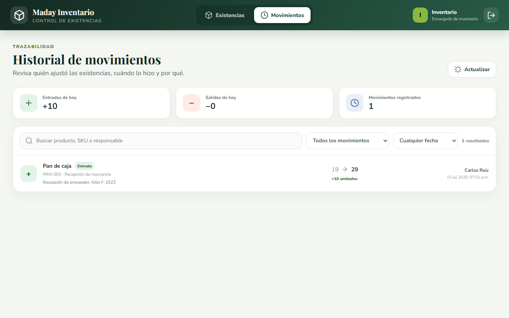

# Reporte de pruebas y limitaciones
**Sistema:** Tiendita Maday
**Cliente:** La Familia
**Versión del reporte:** 1.1
**Fecha de ejecución:** 14 de julio de 2026 (automatizadas) y 15 de julio de 2026 (recorrido visual)
**Revisión base:** `138d4e5` (`main` antes de agregar esta documentación)

> Resultado general: compilación frontend aprobada con advertencias; pruebas backend aprobadas en el alcance ejecutado; recorrido visual de los cinco roles ejecutado en entorno local con evidencia. La aceptación integral sigue condicionada a las pruebas automatizadas con base aislada, la suite frontend y las integraciones externas reales.

<!-- PAGEBREAK -->

## 1. Alcance y método

La validación se ejecutó sobre el código local del repositorio. Se utilizaron los comandos declarados por cada proyecto. No se utilizaron credenciales de producción ni se realizaron cobros reales.

| Componente | Comando o método | Resultado |
|---|---|---|
| Backend | `npm test` | 21 registradas: 19 aprobadas, 0 fallidas, 2 omitidas. |
| Frontend | `npm run build` | Compilación aprobada; salida generada. |
| Frontend | `npm test -- --watch=false` | No aprobado: Vitest informa que no encontró archivos de prueba ejecutables. |
| Prueba visual | Navegador automatizado sobre Docker Compose local | Ejecutada el 15-jul-2026: recorrido de los cinco roles con capturas. |
| Restauración de respaldo | Base aislada | No ejecutada. |

## 2. Resultados backend

El proceso terminó con código 0 en 62.8 segundos. Las 19 pruebas aprobadas cubren principalmente autorización, validación de checkout, reglas de envío y validación de opiniones.

### 2.1 Controles aprobados

- Endpoints de negocio rechazan solicitudes sin autenticar.
- El cliente no puede modificar catálogo ni consultar recursos internos.
- El cajero alcanza el flujo POS pero permanece fuera de recursos administrativos.
- Almacén alcanza ajustes y permanece fuera de administración.
- Gerencia hereda los permisos administrativos previstos.
- Checkout normaliza productos duplicados y rechaza cantidades inválidas.
- Tarifas de envío se calculan desde reglas del servidor.
- Descuentos se limitan y distribuyen entre líneas elegibles.
- Límites y continuidad de zonas de entrega se validan.
- Opiniones validan calificación, longitud e identificadores UUID.

### 2.2 Pruebas omitidas

| Prueba | Motivo | Variable requerida |
|---|---|---|
| Ajuste de inventario registra movimiento auditable | Requiere PostgreSQL de prueba aislado. | `INVENTORY_TEST_DATABASE_URL` |
| POS abre caja, vende, descuenta stock y cierra | Requiere PostgreSQL de prueba aislado. | `POS_TEST_DATABASE_URL` |

El final del proceso también registró un intento de conexión PostgreSQL sin una contraseña válida. No cambió el código de salida, pero confirma que el entorno general no sustituyó las dos pruebas integrales omitidas.

## 3. Resultados frontend

### 3.1 Compilación

La compilación Angular terminó con código 0 en 12.8 segundos. El paquete inicial fue de aproximadamente 365 kB sin comprimir y 100 kB de transferencia estimada, además de módulos de carga diferida.

Se registraron advertencias:

- La hoja de fuente Source Code Pro supera el presupuesto configurado por 6.76 kB.
- Dependencias de `canvg`, `core-js`, `raf`, `rgbcolor` y `html2canvas` usan CommonJS/AMD y pueden reducir optimizaciones.
- El equipo de validación utilizó Node.js 23.11, una versión impar no LTS; producción debe usar Node 20 LTS según la arquitectura del servicio.

### 3.2 Pruebas automatizadas

El comando de pruebas construyó los paquetes de especificación, pero Vitest terminó con código 1 y el mensaje **No test files found**. Aunque existen archivos con extensión `.spec.ts`, actualmente no constituyen una suite ejecutable reconocida por la configuración.

## 4. Recorrido visual del 15 de julio de 2026

Se levantó el sistema completo con Docker Compose local (frontend, backend y PostgreSQL con datos de demostración) y se recorrieron los cinco roles con un navegador automatizado. Las capturas completas ilustran el Manual de Usuario; aquí se resume lo verificado:

- **Autenticación:** inicio de sesión correcto para los roles `customer`, `cashier`, `stock` y `admin`; cada rol llegó a su área correspondiente y la pantalla de recuperación de contraseña carga.
- **Cliente:** catálogo con imágenes, detalle de producto, alta al carrito con confirmación, carrito con totales y primer paso del checkout.
- **Cajero:** apertura de caja con fondo inicial, venta en efectivo de $82.00 con dos productos, cálculo de cambio, confirmación del cobro y visualización del corte con efectivo esperado y diferencia. El stock de los productos vendidos se descontó en la base de datos.
- **Almacén:** consulta de existencias, entrada manual de 10 piezas con motivo y nota, y verificación del movimiento auditable (responsable, cantidades y fecha) en el historial.
- **Administración:** panel de control con métricas, productos, pedidos, usuarios, abastecimiento, caducidades, promociones, finanzas y configuración de tienda con zonas de entrega en mapa.

> El recorrido cubre el flujo feliz en un entorno local con datos de demostración. No sustituye las pruebas integrales automatizadas con base aislada ni la prueba de integraciones externas (PayPal, Google, correo, Cloudinary).

### 4.1 Hallazgo observado durante el recorrido

Una venta en efectivo realizada a las 19:47 hora local no apareció en **Mis ventas** con el filtro del día en curso; apareció al seleccionar la fecha del día siguiente. La causa observada es que la agrupación por día usa la fecha UTC del servidor, por lo que las ventas nocturnas (aproximadamente después de las 18:00 hora del centro de México) se listan en el día siguiente. El efectivo esperado del turno sí se calculó correctamente. Se registra como limitación en la sección 5.

## 5. Matriz de cobertura

| Área | Automatizada | Integración real | Recorrido manual | Estado |
|---|---|---|---|---|
| Autenticación y permisos backend | Sí | Parcial | Ejecutado | Satisfactorio en alcance unitario/rutas. |
| Checkout y envío | Sí | Parcial | Parcial (hasta identificación) | Reglas principales aprobadas. |
| Punto de venta | Permisos | Omitida | Ejecutado (flujo feliz) | Venta real contra PostgreSQL local aprobada; falta prueba automatizada aislada. |
| Inventario | Permisos | Omitida | Ejecutado (flujo feliz) | Movimiento auditable verificado; falta prueba automatizada aislada. |
| Frontend | No ejecutable | No | Ejecutado (flujo feliz) | Brecha de cobertura automatizada. |
| Correo | No | No | Pendiente | Requiere credenciales/configuración. |
| PayPal | No | No | Pendiente | Probar sandbox y conciliación. |
| Google OAuth | No | No | Pendiente | Probar origen y cliente final. |
| Cloudinary | No | No | Pendiente | Probar carga y lectura. |
| Respaldo/restauración | No | No | Pendiente | Debe probarse antes de operación crítica. |

## 6. Limitaciones y riesgos conocidos

| Prioridad | Hallazgo | Riesgo | Acción recomendada |
|---|---|---|---|
| Alta | Pruebas POS e inventario omitidas. | Errores transaccionales podrían aparecer con PostgreSQL real. | Ejecutar contra base desechable inicializada con `init.sql`. |
| Alta | Frontend sin suite ejecutable. | Regresiones de interfaz y guards no se detectan automáticamente. | Corregir configuración Vitest y agregar pruebas de flujos críticos. |
| Alta | Restauración no probada. | Un respaldo existente podría no ser recuperable. | Realizar simulacro y registrar evidencia. |
| Alta | Canales de soporte y propietario de servicios no confirmados. | Incidentes sin responsable y pérdida de control de cuentas. | Completar acta y rotar credenciales. |
| Media | Ventas nocturnas se agrupan en el día UTC siguiente en Mis ventas y el corte por fecha. | Confusión del cajero al buscar sus operaciones; conciliación diaria desfasada. | Ajustar la agrupación por día a la zona horaria de la tienda. |
| Media | Documentos históricos mencionan Angular 17 y roles antiguos. | Operación o mantenimiento con instrucciones incorrectas. | Actualizar arquitectura y diseño de datos. |
| Media | Nombres Tiendita Maday, Verdulería Retama y La Familia mezclados. | Confusión comercial y legal. | Aprobar una marca oficial y normalizarla. |
| Media | Advertencias de optimización frontend. | Paquete mayor o rendimiento inferior al posible. | Presupuestar fuente y revisar dependencias CommonJS. |
| Media | Términos y contactos incluidos en la UI requieren revisión del cliente. | Información legal o de soporte inexacta. | Revisión legal/comercial antes de producción. |
| Baja | Documentos duplicados sin etiqueta de versión final. | El cliente puede usar una versión antigua. | Archivar fuentes y marcar finales. |

## 7. Pruebas pendientes para aceptación

### 7.1 Técnicas

- [ ] Crear PostgreSQL de prueba desechable desde `Database/init.sql`.
- [ ] Ejecutar las dos pruebas integrales con sus variables de entorno.
- [ ] Corregir y ejecutar la suite frontend.
- [ ] Ejecutar compilación con Node 20 LTS y configuración de producción.
- [ ] Probar migraciones desde una copia de la base actual.
- [ ] Crear un respaldo y restaurarlo en una base nueva.

### 7.2 Negocio

- [ ] Administrador inicia sesión y administra un usuario.
- [ ] Cajero abre caja, vende en efectivo y cierra sin diferencia.
- [ ] Se registra una tarjeta aprobada por terminal externa sin cobro duplicado.
- [ ] Almacén registra entrada y salida con movimiento auditable.
- [ ] Cliente completa pedido de recolección.
- [ ] Cliente completa pedido de entrega y la tarifa es correcta.
- [ ] PayPal sandbox confirma y concilia un pedido.
- [ ] Recuperación de contraseña llega al correo real.
- [ ] Imagen de producto se almacena y vuelve a cargar.
- [ ] Pedido y existencia permanecen correctos después de actualizar la página.

Los puntos de cajero y almacén fueron pre-verificados en el recorrido local del 15 de julio (sección 4); deben repetirse en el entorno definitivo del cliente durante la prueba de aceptación.

## 8. Criterio de salida recomendado

La versión puede presentarse para una **aceptación condicionada**, ya que compila, los controles backend ejecutados no muestran fallas y el recorrido visual local de los cinco roles se completó sin errores funcionales. No se recomienda una aceptación final sin reservas hasta aprobar al menos:

1. Integraciones POS e inventario en una base aislada.
2. Recorrido manual de los cinco roles en el entorno definitivo.
3. Prueba de pagos en sandbox y correo real.
4. Simulacro de respaldo y restauración.
5. Corrección o acuerdo explícito sobre la ausencia de pruebas frontend.

## 9. Evidencia resumida

| Fecha | Evidencia | Resultado |
|---|---|---|
| 14-jul-2026 | Backend `npm test` | 19 pass, 0 fail, 2 skip, código 0. |
| 14-jul-2026 | Frontend `npm run build` | Aprobado con advertencias, código 0. |
| 14-jul-2026 | Frontend `npm test -- --watch=false` | No test files found, código 1. |
| 15-jul-2026 | Recorrido visual de los cinco roles (Docker local) | Completado; 25 capturas en `Fuentes/capturas/`. |
| 15-jul-2026 | Venta en efectivo y movimiento de inventario contra PostgreSQL local | Aprobados; stock y auditoría correctos. |
| 15-jul-2026 | Filtro por día en Mis ventas | Hallazgo: agrupación por fecha UTC (sección 4.1). |

> Este reporte no certifica seguridad, cumplimiento legal, rendimiento a escala ni disponibilidad de terceros. Describe exactamente la evidencia ejecutada y los huecos observados.
